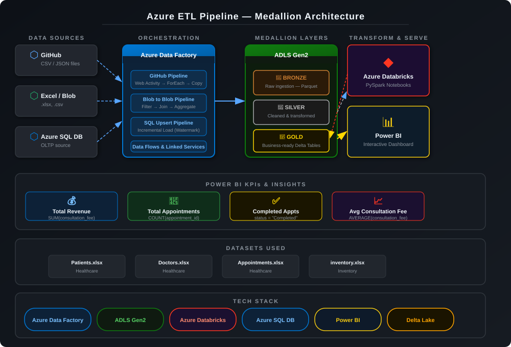

# 🚀 Azure ETL Framework — Medallion Architecture

> An end-to-end cloud-based ETL framework using **Azure Data Factory**, **Azure Databricks**, and **ADLS Gen2** implementing the **Medallion Architecture** (Bronze → Silver → Gold) for healthcare analytics.

---

## 📌 Table of Contents

- [Overview](#-overview)
- [Architecture Diagram](#-architecture-diagram)
- [Tech Stack](#-tech-stack)
- [Project Components](#-project-components)
- [Datasets](#-datasets)
- [Medallion Architecture](#-medallion-architecture)
- [Power BI Dashboard](#-power-bi-dashboard)
- [Azure Resources Required](#-azure-resources-required)
- [Setup & Deployment Instructions](#-setup--deployment-instructions)
- [Estimated Cost](#-estimated-cost)
- [Folder Structure](#-folder-structure)
- [Key Learnings](#-key-learnings)

---

## 📖 Overview

This project demonstrates a **complete, production-style data engineering pipeline** on Azure. It ingests data from multiple sources (GitHub API, Excel files, Azure SQL), processes it through a 3-layer Medallion Architecture, and delivers business insights via an interactive Power BI dashboard.

**Use Case:** A healthcare data platform that tracks doctor appointments, patient records, revenue, and consultation performance across cities and specializations.

---

## 🏗️ Architecture Diagram



**Pipeline Flow:**

```
Data Sources          Orchestration          Storage Layers        Analytics
─────────────         ─────────────          ──────────────        ─────────
GitHub Repo   ──┐
Excel / Blob  ──┼──► Azure Data Factory ──► ADLS Gen2       ──► Power BI
Azure SQL DB  ──┘     (4 Pipelines)          Bronze → Silver      Dashboard
                                             ↓ Databricks
                                             Silver → Gold
```

---

## 🛠 Tech Stack

| Service | Purpose |
|---|---|
| **Azure Data Factory (ADF)** | Pipeline orchestration, data movement |
| **Azure Blob Storage** | Raw file staging area |
| **Azure Data Lake Gen2 (ADLS)** | Medallion layer storage (Bronze/Silver/Gold) |
| **Azure SQL Database** | OLTP source + incremental load target |
| **Azure Databricks** | PySpark transformation notebooks |
| **Delta Lake** | ACID-compliant tables in Gold layer |
| **Power BI** | Business intelligence dashboards |
| **GitHub API** | External data source via Web Activity |

---

## 📂 Project Components

### 🔹 Pipeline 1 — GitHub to Blob (`GitHubPipeline`)

Fetches raw CSV/JSON files from a GitHub repository using the GitHub REST API.

**Activities:**
- `Web Activity` — GET request to GitHub API
- `ForEach` — Iterates over file list
- `Copy Activity` — Writes files to Azure Blob Storage

**Trigger:** Scheduled or event-based

---

### 🔹 Pipeline 2 — Blob to Azure SQL (`StudentPipeline`, `FacultyPipeline`)

Loads CSV files from Blob Storage into Azure SQL Database using **Upsert** for incremental ingestion.

**Key Features:**
- Incremental load via watermark column
- Primary keys: `StudentID`, `FacultyID`
- Conflict handling via Upsert (Insert + Update)

---

### 🔹 Pipeline 3 — Blob to Blob (`BlobToBlob`)

Reads multi-source files, applies transformations using ADF Data Flows, and writes a single consolidated output.

**Transformations:**
| Step | Description |
|---|---|
| `Filter` | Watermark-based incremental processing |
| `Join` | Customers + Orders |
| `Aggregate` | Removes duplicate Products |
| `Derived Column` | `TotalAmount = Quantity * Price` |

---

### 🔹 Pipeline 4 — SQL to ADLS Medallion (`MedallionPipeline`)

Reads from Azure SQL Database and writes through Bronze → Silver → Gold using Databricks notebooks.

---

## 📊 Datasets

| File | Type | Domain |
|---|---|---|
| `patients.xlsx` | Excel | Healthcare |
| `Doctors.xlsx` | Excel | Healthcare |
| `appointments.xlsx` | Excel | Healthcare |
| `organizations-1000.csv` | CSV | Business |

---

## 🥇 Medallion Architecture

```
Azure SQL / Blob
      │
      ▼
┌──────────────────────────────────────────────────┐
│  🥉 BRONZE LAYER  (Raw)                          │
│  - No transformation                             │
│  - Format: Parquet                               │
│  - Path: adls://healthcare/bronze/               │
└──────────────────────────────────────────────────┘
      │
      ▼  (Databricks PySpark Notebook)
┌──────────────────────────────────────────────────┐
│  🥈 SILVER LAYER  (Cleaned)                      │
│  - Nulls handled, types cast                     │
│  - Deduplication applied                         │
│  - Path: adls://healthcare/silver/               │
└──────────────────────────────────────────────────┘
      │
      ▼  (Databricks PySpark Notebook)
┌──────────────────────────────────────────────────┐
│  🥇 GOLD LAYER  (Business Ready)                 │
│  - Aggregated, joined, analytics-ready           │
│  - Format: Delta Tables                          │
│  - Table: gold_analytics                         │
│  - Path: adls://healthcare/gold/                 │
└──────────────────────────────────────────────────┘
      │
      ▼
  Power BI Dashboard
```

---

## 📈 Power BI Dashboard

The dashboard connects directly to the **Gold layer** Delta tables.

### KPIs
| Metric | DAX Query |
|---|---|
| Total Revenue | `SUM(gold_analytics[consultation_fee])` |
| Total Appointments | `COUNT(gold_analytics[appointment_id])` |
| Completed Appointments | `CALCULATE(COUNT(...), status = "Completed")` |
| Avg Consultation Fee | `AVERAGE(gold_analytics[consultation_fee])` |

### Visualizations
- 📊 Monthly Revenue Trend (Line Chart)
- 🏥 Revenue by Specialization (Bar Chart)
- 🗺️ Revenue by City (Map / Filled Map)
- 👨‍⚕️ Top Doctors Performance (Table)
- ✅ Appointment Status Breakdown (Donut Chart)

---

## ☁️ Azure Resources Required

Before running the pipelines, create the following resources in a single **Resource Group**:

| Resource | Type | SKU / Tier |
|---|---|---|
| Resource Group | - | Free |
| Storage Account (Blob) | `StorageV2` | Standard LRS |
| ADLS Gen2 | `StorageV2` with HNS enabled | Standard LRS |
| Azure SQL Database | `SQL Database` | Basic (5 DTU) |
| Azure Data Factory | `V2` | Standard |
| Azure Databricks | Workspace | Standard |
| Power BI | Desktop (free) or Pro | Free / Pro |

> ⚠️ **Note:** A GitHub Personal Access Token (PAT) is required to authenticate the GitHub API calls inside ADF's Web Activity. Store it securely in **Azure Key Vault**.

---

## 🚀 Setup & Deployment Instructions

Follow these steps in order:

### Step 1 — Create Azure Resources

```bash
# Log in to Azure CLI
az login

# Create a resource group
az group create --name rg-etl-framework --location eastus

# Create a Storage Account (Blob)
az storage account create \
  --name stgetlstorage \
  --resource-group rg-etl-framework \
  --sku Standard_LRS \
  --kind StorageV2

# Create ADLS Gen2 (enable hierarchical namespace)
az storage account create \
  --name adlsetlframework \
  --resource-group rg-etl-framework \
  --sku Standard_LRS \
  --kind StorageV2 \
  --enable-hierarchical-namespace true

# Create Azure SQL Server + Database
az sql server create \
  --name sql-etl-server \
  --resource-group rg-etl-framework \
  --location eastus \
  --admin-user sqladmin \
  --admin-password <YourPassword>

az sql db create \
  --resource-group rg-etl-framework \
  --server sql-etl-server \
  --name etldb \
  --service-objective Basic

# Create Azure Data Factory
az datafactory create \
  --resource-group rg-etl-framework \
  --factory-name adf-etl-framework

# Create Azure Databricks workspace
az databricks workspace create \
  --resource-group rg-etl-framework \
  --name dbw-etl-framework \
  --location eastus \
  --sku standard
```

---

### Step 2 — Upload Data Files to Blob Storage

Upload the sample CSV/Excel files from this repo to your Blob Storage container:

```bash
# Create containers
az storage container create --name inputcontainer --account-name stgetlstorage
az storage container create --name outputcontainer --account-name stgetlstorage
az storage container create --name controlcontainer --account-name stgetlstorage

# Upload files
az storage blob upload-batch \
  --source . \
  --destination inputcontainer \
  --account-name stgetlstorage \
  --pattern "*.csv"

az storage blob upload-batch \
  --source . \
  --destination inputcontainer \
  --account-name stgetlstorage \
  --pattern "*.xlsx"
```

---

### Step 3 — Create ADLS Folder Structure

```
adlsetlframework/
└── healthcare/
    ├── bronze/
    ├── silver/
    └── gold/
```

```bash
# Create ADLS filesystem and directories
az storage fs create --name healthcare --account-name adlsetlframework
az storage fs directory create -n bronze -f healthcare --account-name adlsetlframework
az storage fs directory create -n silver -f healthcare --account-name adlsetlframework
az storage fs directory create -n gold   -f healthcare --account-name adlsetlframework
```

---

### Step 4 — Configure Azure Data Factory

1. Open **Azure Data Factory Studio**
2. Go to **Manage → Linked Services** and create connections for:
   - Azure Blob Storage
   - ADLS Gen2
   - Azure SQL Database
   - GitHub (via HTTP Linked Service with PAT token)
3. Go to **Author → Datasets** and create datasets for each source/sink
4. Import or recreate the 4 pipelines:
   - `GitHubPipeline`
   - `StudentPipeline` / `FacultyPipeline`
   - `BlobToBlob`
   - `MedallionPipeline`
5. Create a **Watermark table** in SQL for incremental load:

```sql
CREATE TABLE watermark (
    TableName VARCHAR(100),
    LastModifiedDate DATETIME
);

INSERT INTO watermark VALUES ('orders', '1900-01-01');
```

---

### Step 5 — Set Up Azure Databricks

1. Launch the Databricks workspace
2. Create a cluster (Standard_DS3_v2, runtime 12.x LTS)
3. Mount ADLS Gen2 to Databricks:

```python
configs = {
  "fs.azure.account.auth.type": "OAuth",
  "fs.azure.account.oauth.provider.type": "org.apache.hadoop.fs.azurebfs.oauth2.ClientCredsTokenProvider",
  "fs.azure.account.oauth2.client.id": "<app-id>",
  "fs.azure.account.oauth2.client.secret": dbutils.secrets.get(scope="kv", key="client-secret"),
  "fs.azure.account.oauth2.client.endpoint": "https://login.microsoftonline.com/<tenant-id>/oauth2/token"
}

dbutils.fs.mount(
  source = "abfss://healthcare@adlsetlframework.dfs.core.windows.net/",
  mount_point = "/mnt/healthcare",
  extra_configs = configs
)
```

4. Upload the `medillion code.ipynb` notebook and run it

---

### Step 6 — Connect Power BI

1. Open Power BI Desktop
2. Get Data → **Azure Databricks** → connect to your cluster
3. Select the `gold_analytics` Delta table
4. Build visuals using the DAX measures in the [dashboard section](#-power-bi-dashboard)
5. Publish to Power BI Service (optional)

---

### Step 7 — Run All Pipelines

In ADF Studio, trigger each pipeline in order:

```
1. GitHubPipeline       → loads raw files to Blob
2. StudentPipeline      → upserts to SQL
3. FacultyPipeline      → upserts to SQL
4. BlobToBlob           → transforms Blob data
5. MedallionPipeline    → Bronze → Silver → Gold via Databricks
```

---

## 💰 Estimated Cost

> Approximate monthly costs for **development/test** scale. Production costs will vary.

| Resource | Estimated Monthly Cost |
|---|---|
| Azure Data Factory (pipeline runs) | ~$1–5 |
| Azure Blob Storage (< 1 GB) | ~$0.02 |
| ADLS Gen2 (< 1 GB) | ~$0.05 |
| Azure SQL Database (Basic 5 DTU) | ~$5 |
| Azure Databricks (Standard, small cluster 2hr/day) | ~$15–30 |
| Power BI Desktop | Free |
| **Total (approx.)** | **~$20–40 / month** |

> 💡 Use the [Azure Pricing Calculator](https://azure.microsoft.com/en-us/pricing/calculator/) for precise estimates. Stop Databricks clusters when not in use to save cost.

---

## 📁 Folder Structure

```
azure-etl-framework/
│
├── 📓 medillion code.ipynb      # Databricks PySpark transformation notebook
├── 📊 mainproject.pbix          # Power BI dashboard file
│
├── 📁 data/                     # Sample datasets
│   ├── patients.xlsx
│   ├── Doctors.xlsx
│   ├── appointments.xlsx
│   ├── customers-10000.csv
│   ├── organizations-1000.csv
│   ├── products-1000.csv
│   ├── india_job_market.xcel.csv
│   └── Weather_Dataset.csv
│
├── 🖼️ architecture-diagram.svg  # Pipeline architecture diagram
└── 📄 README.md
```

---

## 🎯 Key Learnings

- Designing end-to-end cloud data pipelines on Azure
- Incremental data loading using **watermark** strategy and **Upsert**
- **Medallion Architecture** — separating raw, cleaned, and analytics layers
- Transforming data with **ADF Data Flows** and **Databricks PySpark**
- Consuming Delta Tables from Power BI for real-time analytics
- Using GitHub API as a live data source inside ADF

---

## 👤 Author

**Sai Manoj Ranga**
- GitHub: [@Sai-manoj-ranga](https://github.com/Sai-manoj-ranga)
## Co-Authors
**Suchandana Alluri**
**Sumanth Ravichettu**
**Tejeswar Reddy Somula**
---

*Built with Azure ☁️ | Powered by Data Engineering*
